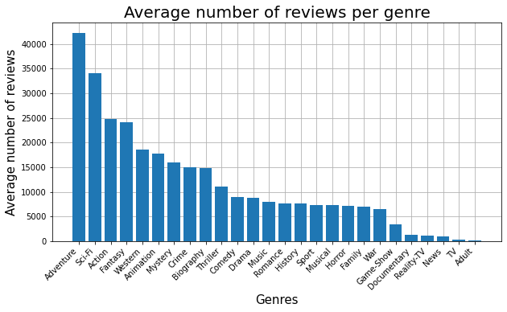
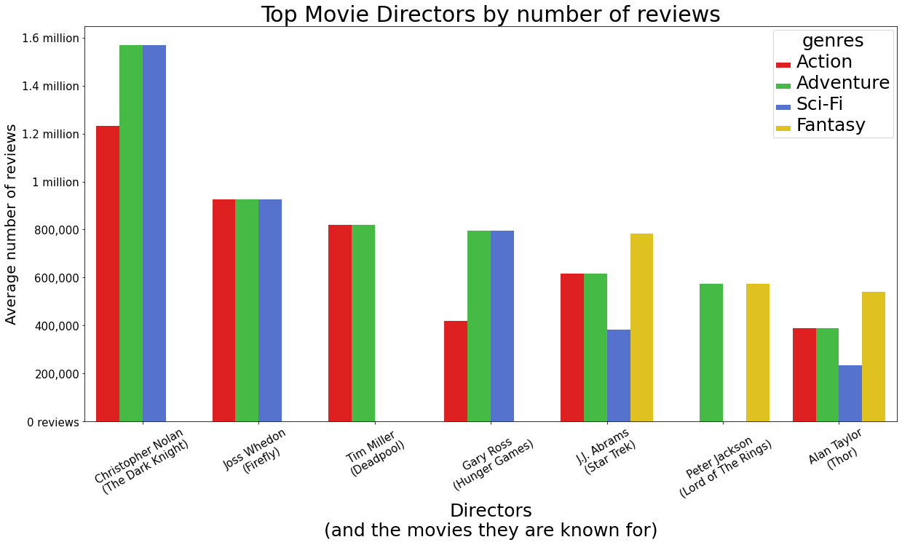
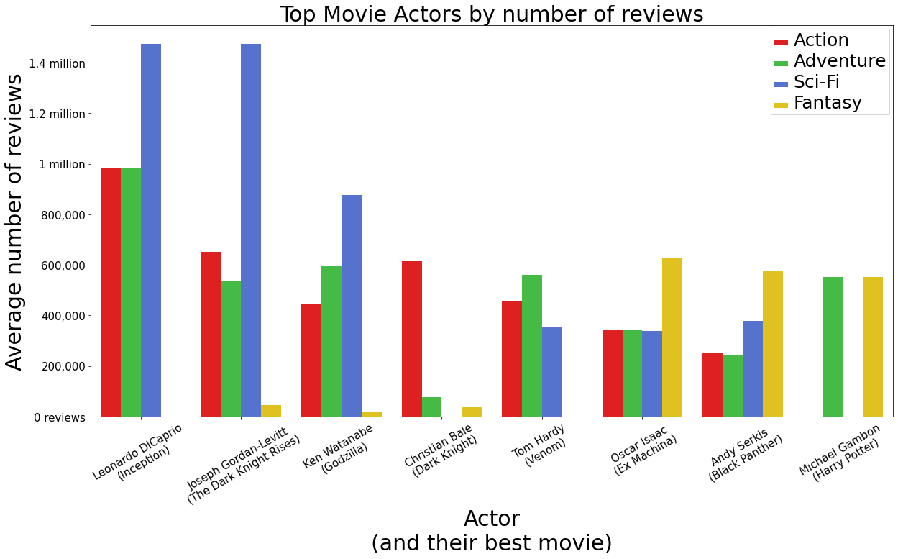

# Film Industry Analysis
#### By John Harrigan

## Overview
Using detailed analysis of over a hundred thousand movies in the last few decades, it can be shown that there is a method to the madness that accompanies making a successful new movie. Microsoft can use this analysis choose the right genre of movie and the best staff to entrust with that movie's creation. 

## Business Problem

This project is all about helping a new movie studio break into the film industry. Microsoft wants to know how to get in on the movie action
that has benefitted so many other companies. They want to know what specific factors are responcible for a new movie's success or downfall so that their new movie studio can have the best chance at the former and avoid the latter. 

## Data
There are several websites dedicated to movies and all the information about them. These websites like "IMDB" and "The Movie Database" contain vast amounts of data on almost every movie made in the last century. Each movie has their own unique ID as well as the basic information about the movies such as: title, release date, runtime, genre(s), the director, a list of actors, and several other types of metadata for each movie. 

## Methods
With the use of proven correlation and desciptive analysis, this project shows there are distinct patterns that all of the most successful movies share with regaurds to their chosen genre and employees.

## Results
There is a high correlation between the number of rating a movie has and its popularity/success. It stands to reason that the more popular a movie is, the more people that watch it, the more people that have the opportunity and inclination to rate it. Using the number of ratings as a guide we can see that the four most popular genres are Adventure, Sci-Fi, Action, and Fantasy.

If we were to choose one of these most popular genres we then would need a director with skill and experience in that genre. The crossover from the top three directors in each of the four genres shows us that it is Christopher Nolan who is the most successful director overall, with the exception of the Fantasy genre which belongs to J.J. Abrams.

After we have chosen our genre and director we must finally choose an actor to cast in the leading role. Using the same analysis process for directors, we can analyize the top actors in each of the most popular genres to find the best of the best. According to this dataset, the best of the best is Leonardo DiCaprio in almost every genre except Fantasy, which belongs to Oscar Isaac.

## Conclusions
The results of the analysis show a clear path for what a new movie studio should do to make the next big blockbuster:

- **Pick a movie genre among the top four most popular genres.** based on analysis the most popular and successful movie genres are Adventure, Sci-Fi, Action, and Fantasy.
- **Choose the director that has had the most success in the chosen genre.** From the data we can see that Christopher Nolan has had the most success in Action, Sci-Fi and Adventure while J.J. Abrams has had the most success in Fantasy.
- **Hire the most talented actor for the leading role.** The project's analysis cleary shows that Leonardo DiCaprio is the best overall actor and would be the first guy to cast for the main character. Although if you made a Fantasy movie you might want to consider Oscar Isaac.

## Next Steps
More comprehensive analysis could help to get even more specific steps for making the movie

- **Getting a bigger dataset.** This would allow for a bigger pool of top list actors and directors to choose from. The bigger dataset could also be used to fill in some of the holes in the existing dataset
- **Finding data specifically for revenue.** This project used the number of ratings as a measure of popularity/success because it was the best data set available. The total amount of revenue would have been a much strong indicator except that the database containing that information was substantially smaller and had many erroneous values. This made it unsuitable to analyze the rest of the dataset.
- **Calculating the specific correlations between each actor and director.** Once the best actor and director for a genre have been chosen, a more thourogh analysis could be done to see, of the best actors and directors, which pair work the best in concert with each other. This could lead to much more specific recommendations for starting a new movie.
